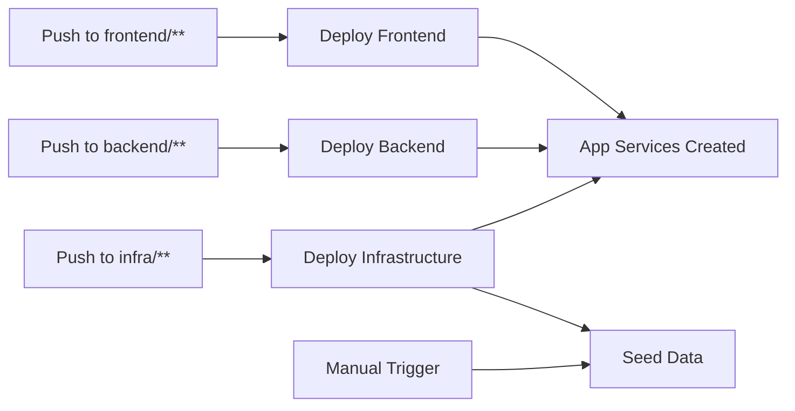

# GitHub Actions CI/CD Implementation Summary

## ✅ Completed Tasks

All GitHub Actions workflows have been successfully implemented for the Ground Truth Curation App.

## 📁 Files Created

### Workflow Files
1. **`.github/workflows/deploy-infrastructure.yml`** - Infrastructure deployment via Bicep
2. **`.github/workflows/deploy-backend.yml`** - Backend .NET 8 API deployment
3. **`.github/workflows/deploy-frontend.yml`** - Frontend React app deployment
4. **`.github/workflows/seed-data.yml`** - Database seeding (manual trigger only)

### Documentation Files
5. **`.github/workflows/SETUP.md`** - Comprehensive setup guide with step-by-step instructions
6. **`.github/workflows/README.md`** - Complete workflow documentation with troubleshooting

### Updates
7. **`README.md`** - Added workflow status badges

## 🎯 Key Features Implemented

### Infrastructure Deployment
- ✅ Automatic trigger on `infra/**` changes
- ✅ Manual trigger with environment selection
- ✅ Bicep linting and validation
- ✅ What-if analysis before deployment
- ✅ Incremental deployment mode
- ✅ All app settings configured via Bicep
- ✅ Resource verification after deployment

### Backend Deployment
- ✅ Automatic trigger on `backend/**` changes
- ✅ .NET 8 SDK with build caching
- ✅ NuGet package caching via `packages.lock.json`
- ✅ Release configuration build
- ✅ Zip deployment to App Service
- ✅ Health endpoint verification (`/healthz`)
- ✅ Automatic app restart

### Frontend Deployment
- ✅ Automatic trigger on `frontend/**` changes
- ✅ pnpm and Node.js 20 with caching
- ✅ Frozen lockfile installation
- ✅ Production build with proper structure
- ✅ Runtime server package included
- ✅ Zip deployment to App Service
- ✅ Site accessibility verification

### Data Seeding
- ✅ Manual trigger only
- ✅ Environment selection (staging/production)
- ✅ Optional sample data inclusion
- ✅ Ground Truth SQL database seeding
- ✅ System SQL database seeding
- ✅ Cosmos DB seeding
- ✅ Azure AD token authentication for SQL

### Security & Best Practices
- ✅ OpenID Connect (OIDC) federated credentials
- ✅ No long-lived secrets
- ✅ Least privilege service principal
- ✅ Environment-based approvals support
- ✅ Build artifact caching
- ✅ Comprehensive error handling

## 🔐 Authentication Architecture

All workflows use **Federated OIDC credentials**:
- GitHub OIDC provider → Azure AD → Service Principal
- Short-lived tokens, automatically rotated
- No client secrets stored in GitHub
- Secure, keyless authentication

## 📋 Required Setup (Next Steps)

Before workflows can run, complete these setup steps:

### 1. Create Azure Service Principal

```bash
# Create Azure AD application
APP_ID=$(az ad app create --display-name "sp-github-groundtruth-cicd" --query appId -o tsv)

# Create service principal for the application
az ad sp create --id $APP_ID

# Assign Contributor role
az role assignment create \
  --assignee $APP_ID \
  --role Contributor \
  --scope /subscriptions/$SUBSCRIPTION_ID

# Reset credentials with 180-day expiry
az ad app credential reset \
  --id $APP_ID \
  --end-date $(date -u -d "180 days" '+%Y-%m-%dT%H:%M:%SZ')

# Save the APP_ID as CLIENT_ID for federated credentials
CLIENT_ID=$APP_ID
echo "Client ID: $CLIENT_ID"
```

**Or to reset credentials for an existing service principal:**

```bash
az ad sp credential reset \
  --id $CLIENT_ID \
  --end-date $(date -u -d "180 days" '+%Y-%m-%dT%H:%M:%SZ')
```

### 2. Configure Federated Credentials

```bash
# Option 1: For main branch (RECOMMENDED - deployments after PR merge)
az ad app federated-credential create \
  --id $CLIENT_ID \
  --parameters '{
    "name": "github-deploy-main",
    "issuer": "https://token.actions.githubusercontent.com",
    "subject": "repo:veritaserum27/Ground-Truth-Curation-App:ref:refs/heads/main",
    "audiences": ["api://AzureADTokenExchange"]
  }'

# Option 2: For iac branch (if deploying from feature branch)
az ad app federated-credential create \
  --id $CLIENT_ID \
  --parameters '{
    "name": "github-deploy-iac",
    "issuer": "https://token.actions.githubusercontent.com",
    "subject": "repo:veritaserum27/Ground-Truth-Curation-App:ref:refs/heads/iac",
    "audiences": ["api://AzureADTokenExchange"]
  }'

# Option 3: For all pull requests (use for lint/scan workflows, not deployment)
az ad app federated-credential create \
  --id $CLIENT_ID \
  --parameters '{
    "name": "github-deploy-pr",
    "issuer": "https://token.actions.githubusercontent.com",
    "subject": "repo:veritaserum27/Ground-Truth-Curation-App:pull_request",
    "audiences": ["api://AzureADTokenExchange"]
  }'

# Option 4: For staging environment (alternative approach)
az ad app federated-credential create \
  --id $CLIENT_ID \
  --parameters '{
    "name": "github-deploy-staging",
    "issuer": "https://token.actions.githubusercontent.com",
    "subject": "repo:veritaserum27/Ground-Truth-Curation-App:environment:staging",
    "audiences": ["api://AzureADTokenExchange"]
  }'
```

**Recommendation**: Use Option 1 (main branch) for deployment workflows that run after PR approval and merge. Use Option 3 (pull_request) for separate lint/format/scan workflows that run when PRs are opened.

### 3. Configure GitHub Secrets
- `AZURE_CLIENT_ID`
- `AZURE_TENANT_ID`
- `AZURE_SUBSCRIPTION_ID`

### 4. Configure GitHub Variables
- `AZURE_RESOURCE_GROUP`
- `AZURE_LOCATION`
- `RESOURCE_NAME_PREFIX`
- `SQL_AAD_ADMIN_LOGIN`
- `SQL_AAD_ADMIN_OBJECT_ID`

**Detailed instructions**: See `.github/workflows/SETUP.md`

## 🚀 Deployment Flow



### Recommended Order
1. **Deploy Infrastructure** (creates all Azure resources)
2. **Deploy Backend** and **Frontend** (can run in parallel)
3. **Seed Data** (optional, manual only)

## 📊 Workflow Triggers

| Workflow       | Automatic                                 | Manual | Trigger        |
| -------------- | ----------------------------------------- | ------ | -------------- |
| Infrastructure | Push to `main` with `infra/**` changes    | ✅      | After PR merge |
| Backend        | Push to `main` with `backend/**` changes  | ✅      | After PR merge |
| Frontend       | Push to `main` with `frontend/**` changes | ✅      | After PR merge |
| Seed Data      | ❌                                         | ✅      | Manual only    |

**Note**: Deployment workflows run after PR approval and merge to `main`. Create separate lint/format/scan workflows to run when PRs are opened.

## 🎨 Features Highlights

### Build Optimization
- **Backend**: NuGet package caching reduces build time by ~50%
- **Frontend**: pnpm store caching reduces build time by ~60%
- **Artifacts**: Build artifacts passed between jobs (no rebuilding)

### Configuration Management
- **All app settings configured via Bicep** (no manual configuration needed)
- Backend receives database connection strings automatically
- Frontend receives backend API URL automatically
- Managed identities for database access (no connection secrets)

### Environment Support
- Single staging environment configured
- Easy to extend to production with approval gates
- Environment-specific secrets and variables
- Protection rules support

### Observability
- Deployment summaries in GitHub Actions
- Health check verification
- Resource verification after deployment
- Detailed logging at each step

## 📖 Documentation

### For Setup
- **`.github/workflows/SETUP.md`** - Complete setup guide with commands

### For Usage
- **`.github/workflows/README.md`** - Workflow details, troubleshooting, monitoring

### For Reference
- Status badges in main `README.md`
- Inline comments in workflow files
- Error messages with troubleshooting hints

## 🔧 Extensibility

The implementation supports:
- ✅ Multiple environments (staging, production, etc.)
- ✅ Branch-specific deployments
- ✅ Approval gates for production
- ✅ Custom deployment parameters
- ✅ Additional workflow stages
- ✅ Integration with other tools

## 🎉 Ready to Use

All workflows are ready to use once setup is completed:

1. Complete setup steps in `.github/workflows/SETUP.md`
2. Commit and push to trigger workflows
3. Monitor in GitHub Actions tab
4. Review deployment summaries
5. Verify in Azure Portal

## 📝 Next Steps

1. **Complete Azure Setup**: Follow `.github/workflows/SETUP.md`
2. **Test Infrastructure Deployment**: Manually trigger infrastructure workflow
3. **Deploy Applications**: Push code changes or manually trigger
4. **Seed Databases**: Manually trigger seed workflow (optional)
5. **Configure Branch Protection**: Add protection rules for `main` branch
6. **Set Up Production**: Create production environment with approval gates

---

For detailed instructions, see `.github/workflows/SETUP.md` and `.github/workflows/README.md`.
