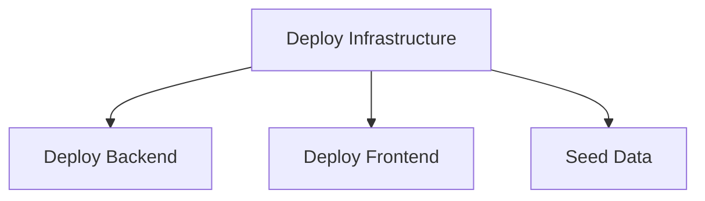

# GitHub Actions Workflows

This directory contains GitHub Actions workflows for automated CI/CD of the Ground Truth Curation App to Azure.

## 📋 Workflows Overview

| Workflow | Purpose | Triggers | Manual |
|----------|---------|----------|--------|
| [Deploy Infrastructure](#deploy-infrastructure) | Deploys Azure resources via Bicep | Push to `infra/**` | ✅ |
| [Deploy Backend](#deploy-backend) | Builds and deploys .NET API | Push to `backend/**` | ✅ |
| [Deploy Frontend](#deploy-frontend) | Builds and deploys React app | Push to `frontend/**` | ✅ |
| [Seed Data](#seed-data) | Seeds databases with data | Manual only | ✅ |

## 🚀 Getting Started

### Prerequisites

Before using these workflows, complete the setup in [SETUP.md](./SETUP.md):

1. Create Azure service principal with federated OIDC credentials
2. Configure GitHub repository secrets
3. Set up GitHub repository variables
4. Verify Azure permissions

### Quick Start Checklist

- [ ] Azure service principal created
- [ ] Federated credentials configured for your branch
- [ ] GitHub secrets configured (`AZURE_CLIENT_ID`, `AZURE_TENANT_ID`, `AZURE_SUBSCRIPTION_ID`)
- [ ] GitHub variables configured (`AZURE_RESOURCE_GROUP`, `RESOURCE_NAME_PREFIX`, etc.)
- [ ] SQL admin details configured
- [ ] First infrastructure deployment tested

## 📖 Workflow Details

### Deploy Infrastructure

**File**: `deploy-infrastructure.yml`

Deploys Azure infrastructure using Bicep templates.

**Automatic Triggers**:
- Push to `main` or `iac` branch with changes in `infra/**`

**Manual Triggers**:
- Go to Actions → Deploy Infrastructure → Run workflow
- Choose environment (staging/production)
- Optionally skip what-if validation

**What It Does**:
1. **Validate**: Runs Bicep linter and what-if analysis
2. **Deploy**: Creates/updates Azure resources:
   - Resource Group
   - App Service Plan
   - Backend App Service (with managed identity and configuration)
   - Frontend App Service (with managed identity and configuration)
   - System SQL Server and Database
   - Ground Truth SQL Server and Database
   - Cosmos DB Account (serverless NoSQL)
   - Virtual Network with subnets
   - Private endpoints and DNS zones
3. **Verify**: Checks deployed resources are healthy

**Outputs**:
- Backend and Frontend App Service names
- Database connection details
- App URLs

**Required Secrets/Variables**:
- `AZURE_CLIENT_ID`, `AZURE_TENANT_ID`, `AZURE_SUBSCRIPTION_ID`
- `AZURE_RESOURCE_GROUP`, `AZURE_LOCATION`, `RESOURCE_NAME_PREFIX`
- `SQL_AAD_ADMIN_LOGIN`, `SQL_AAD_ADMIN_OBJECT_ID`

**Notes**:
- Uses incremental deployment mode (won't delete existing resources)
- All app configuration is set via Bicep (no manual App Service settings needed)
- First deployment typically takes 10-15 minutes

### Deploy Backend

**File**: `deploy-backend.yml`

Builds and deploys the .NET 8 backend API to Azure App Service.

**Automatic Triggers**:
- Push to `main` or `iac` branch with changes in `backend/**`

**Manual Triggers**:
- Go to Actions → Deploy Backend → Run workflow
- Choose environment (staging/production)

**What It Does**:
1. **Build**:
   - Restores .NET dependencies (with caching)
   - Compiles solution in Release configuration
   - Publishes API project
   - Creates zip deployment package
2. **Deploy**:
   - Authenticates to Azure
   - Deploys zip package to App Service
   - Restarts app for clean startup
   - Verifies health endpoint

**Build Caching**:
- Caches NuGet packages based on `packages.lock.json`
- Significantly speeds up subsequent builds

**Health Check**:
- Endpoint: `/healthz`
- Expected: HTTP 200

**Required Secrets/Variables**:
- `AZURE_CLIENT_ID`, `AZURE_TENANT_ID`, `AZURE_SUBSCRIPTION_ID`
- `AZURE_RESOURCE_GROUP`, `RESOURCE_NAME_PREFIX`

**Notes**:
- Build typically takes 2-3 minutes
- Deployment takes 1-2 minutes
- Backend uses system-assigned managed identity for database access

### Deploy Frontend

**File**: `deploy-frontend.yml`

Builds and deploys the React frontend application to Azure App Service.

**Automatic Triggers**:
- Push to `main` or `iac` branch with changes in `frontend/**`

**Manual Triggers**:
- Go to Actions → Deploy Frontend → Run workflow
- Choose environment (staging/production)

**What It Does**:
1. **Build**:
   - Installs pnpm and Node.js 20 (with caching)
   - Installs dependencies with frozen lockfile
   - Builds production assets
   - Creates deployment package with runtime server
2. **Deploy**:
   - Authenticates to Azure
   - Deploys zip package to App Service
   - Restarts app for clean startup
   - Verifies site accessibility

**Build Caching**:
- Caches pnpm store based on `pnpm-lock.yaml`
- Significantly speeds up subsequent builds

**Runtime Configuration**:
- `VITE_API_BASE_URL` set via App Service configuration (from Bicep)
- Uses `serve` package to host static files on port 8080

**Required Secrets/Variables**:
- `AZURE_CLIENT_ID`, `AZURE_TENANT_ID`, `AZURE_SUBSCRIPTION_ID`
- `AZURE_RESOURCE_GROUP`, `RESOURCE_NAME_PREFIX`

**Notes**:
- Build typically takes 2-4 minutes
- Deployment takes 1-2 minutes
- Frontend automatically receives backend URL from Bicep deployment

### Seed Data

**File**: `seed-data.yml`

Seeds databases with schema and data. **Manual trigger only**.

**Manual Triggers**:
- Go to Actions → Seed Database Data → Run workflow
- Choose environment (staging/production)
- Optionally include sample ground truth data

**What It Does**:
1. Retrieves deployment outputs (connection strings)
2. Seeds Ground Truth SQL Database (schema)
3. Seeds System SQL Database (support tickets)
4. Seeds Cosmos DB (manufacturing defects)
5. Optionally seeds sample ground truth data (dev/test only)

**Authentication**:
- Uses Azure CLI access tokens for SQL authentication
- Uses Azure managed identity for Cosmos DB

**Required Secrets/Variables**:
- `AZURE_CLIENT_ID`, `AZURE_TENANT_ID`, `AZURE_SUBSCRIPTION_ID`
- `AZURE_RESOURCE_GROUP`, `RESOURCE_NAME_PREFIX`

**Notes**:
- Must run after infrastructure deployment
- Can be run multiple times (idempotent where possible)
- Sample data option is for development/testing only
- Seeding typically takes 5-10 minutes

## 🔒 Security Best Practices

### Authentication

All workflows use **OpenID Connect (OIDC)** with federated credentials:
- No long-lived secrets stored in GitHub
- Azure service principal authenticates via GitHub's OIDC provider
- Credentials are short-lived and automatically rotated

### Secrets Management

**Never commit**:
- Azure credentials
- Database passwords
- Connection strings
- API keys

**Always use**:
- GitHub Secrets for sensitive values
- GitHub Variables for non-sensitive configuration
- Environment-specific secrets when needed

### Least Privilege

Service principal has minimal required permissions:
- Contributor role on resource group (or subscription)
- Directory Reader role (if reading Azure AD for SQL admin)

### Branch Protection

Recommended branch protection rules:
- Require pull request reviews before merging to `main`
- Require status checks to pass
- Restrict who can push to protected branches
- Use environments with approval gates for production

## 🔧 Troubleshooting

### Authentication Failures

**Symptom**: "AADSTS70021: No matching federated identity record found"

**Solutions**:
1. Verify federated credential subject matches your branch exactly
2. Check branch name in credential: `repo:<org>/<repo>:ref:refs/heads/<branch>`
3. List credentials: `az ad app federated-credential list --id $CLIENT_ID`
4. Create credential for your branch if missing (see SETUP.md)

### Deployment Failures

**Symptom**: "AuthorizationFailed" or "ResourceNotFound"

**Solutions**:
1. Check service principal has Contributor role
2. Verify resource group exists and name is correct
3. Check GitHub variables match Azure resources
4. Review Azure Portal for deployment errors

### Build Failures

**Backend build fails**:
1. Check .NET version is 8.0.x
2. Verify packages.lock.json is committed
3. Check project references are correct
4. Review build logs for specific errors

**Frontend build fails**:
1. Check Node.js version is 20
2. Verify pnpm-lock.yaml is committed
3. Check for TypeScript errors (if enabled)
4. Review build logs for missing dependencies

### Health Check Failures

**Health endpoint returns non-200**:
1. Check App Service logs in Azure Portal
2. Verify managed identity has database access
3. Check database connection strings in App Service configuration
4. Review application logs for startup errors

### Bicep Validation Errors

**What-if or deployment fails**:
1. Test Bicep locally first: `az bicep build --file main.bicep`
2. Run what-if manually: `az deployment group what-if ...`
3. Check parameter values match expected types
4. Review Bicep linter output for issues

## 📊 Monitoring Deployments

### GitHub Actions UI

1. Go to repository → **Actions** tab
2. Select workflow from left sidebar
3. Click on a workflow run to see details
4. View job logs, artifacts, and summaries

### Azure Portal

1. Navigate to your resource group
2. Go to **Deployments** blade
3. View deployment history and details
4. Check App Service logs and metrics

### Deployment Summaries

Each workflow creates a deployment summary with:
- Resource names and URLs
- Health check results
- Deployment status
- Quick links to Azure resources

## 🔄 Workflow Dependencies

**Recommended deployment order**:
1. Run **Deploy Infrastructure** first
2. Run **Deploy Backend** and **Deploy Frontend** (can run in parallel)
3. Run **Seed Data** (optional, manual only)

## 🌍 Multi-Environment Setup

### Adding Production Environment

1. **Create GitHub Environment**:
   - Go to Settings → Environments → New environment
   - Name: `production`
   - Add protection rules:
     - Required reviewers
     - Wait timer
     - Deployment branches

2. **Create Production Resources**:
   - Use different resource group: `<prefix>-ground-truth-app-prod-rg`
   - Use different resource name prefix
   - Update GitHub variables or create environment-specific variables

3. **Configure Approval Gates**:
   - Add required reviewers to production environment
   - Set wait timer if desired
   - Restrict deployment to protected branches

4. **Run Workflows**:
   - Manually trigger workflows
   - Select `production` environment
   - Approval request sent to reviewers
   - Deployment proceeds after approval

### Environment-Specific Configuration

Use GitHub environment secrets/variables:
- Secrets → Environments → Select environment → Add secret
- Different values per environment (e.g., different resource groups)

## 📚 Additional Resources

- [Setup Guide](./SETUP.md) - Complete setup instructions
- [Azure App Service Deployment](https://learn.microsoft.com/en-us/azure/app-service/deploy-github-actions)
- [Bicep GitHub Actions](https://learn.microsoft.com/en-us/azure/azure-resource-manager/bicep/deploy-github-actions)
- [GitHub Environments](https://docs.github.com/en/actions/deployment/targeting-different-environments)
- [OpenID Connect with Azure](https://learn.microsoft.com/en-us/azure/developer/github/connect-from-azure)

## 🆘 Getting Help

1. Check workflow logs in GitHub Actions tab
2. Review Azure deployment history in Portal
3. Check App Service logs and diagnostics
4. Consult Azure documentation for specific errors
5. Open an issue in the repository

## 📝 Workflow Maintenance

### Regular Tasks

- [ ] Review workflow run history monthly
- [ ] Update workflow file versions (actions/checkout@v5, etc.)
- [ ] Rotate service principal credentials if needed
- [ ] Review and update Azure resource configurations
- [ ] Test workflows in staging before production changes

### Version Updates

When updating dependencies:
1. Test locally first
2. Update in staging environment
3. Monitor for issues
4. Roll out to production after validation

---

For setup instructions, see [SETUP.md](./SETUP.md).
