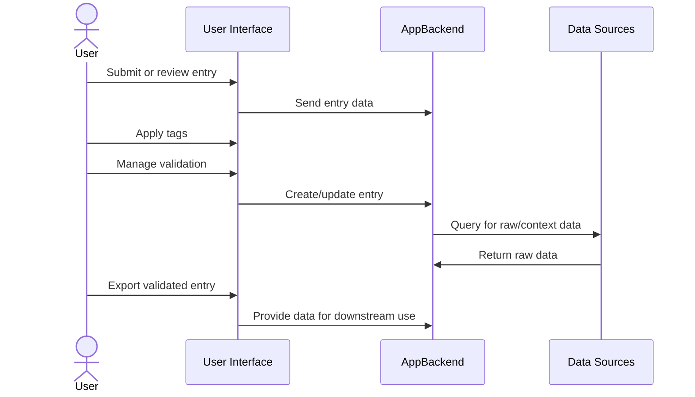

# Ground Truth Curation App – Architecture Overview

## High-Level Components

System Datastore
Ground Truth Database
API
UI

## Sequence Diagrams

```mermaid
```

## Flow Charts

```mermaid
flowchart LR
    subgraph UI[User Interface]
        CURATOR[Curator]
        VALIDATOR[Validator]
    end
    subgraph APP[Ground Truth Curation App]
        ENTRY[Entry Management]
        TAGS[Tagging System]
        VALIDATION[Validation Workflow]
        EXPORT[Export Module]
    end
    subgraph DATA[Data Sources]
        SQL[SQL DB]
        GRAPHQL[GraphQL API]
        OTHER[Other Sources]
    end
    CURATOR --> APP
    VALIDATOR --> APP
    APP --> ENTRY
    APP --> TAGS
    APP --> VALIDATION
    APP --> EXPORT
    ENTRY --> DATA
    VALIDATION --> ENTRY
    EXPORT --> ENTRY
    DATA -->|Raw Data| ENTRY
```

## Component Blocks

### 1. Users

- **Curator**: Adds, edits, tags, and exports ground truth entries.
- **Validator**: Reviews, approves, or requests revisions for entries.

### 2. Ground Truth Curation App

- **Entry Management**: Handles creation and updates of ground truth definitions and entries.
- **Tagging System**: Supports predefined and custom tags with color coding and filtering.
- **Validation Workflow**: Manages review, approval, and revision requests.
- **Export Module**: Exports curated data in JSONL/CSV formats.

### 3. Data Sources

- **SQL DB**: Structured data queries.
- **GraphQL API**: Flexible queries for many data models.
- **Other Sources**: Extensible for new data providers.


## Data Flow

1. **User submits or reviews entries via UI.**

2. **App processes entries, applies tags, and manages validation.**

3. **App queries data sources for raw data and context.**

4. **App exports validated entries for downstream use.**



## References

- See `docs/GroundTruthCurationProcess.md` for process details.
- See `docs/GroundTruthERD.md` for entity relationships.
