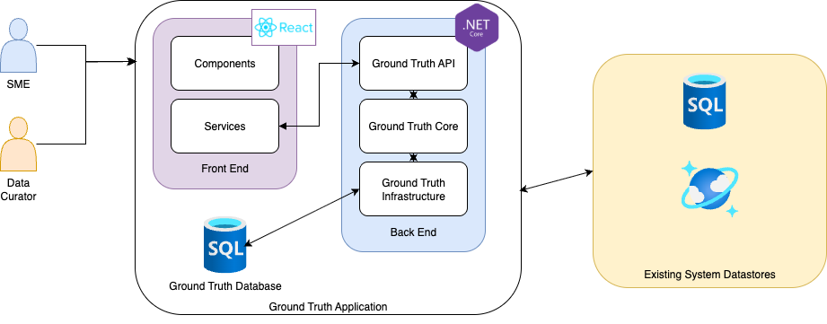
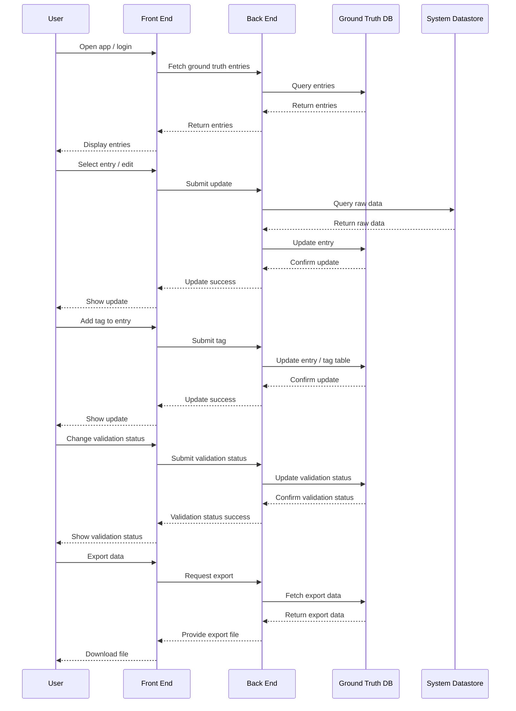
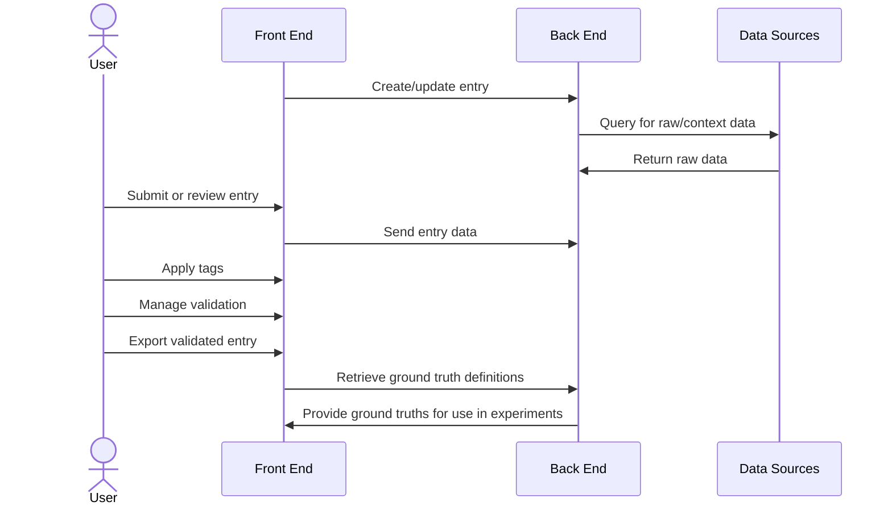

# Ground Truth Curation App – Architecture Overview

- Author: Laura Lund
- Last Updated: 2025-09-15
- Tool: [Mermaid Chart](https://mermaid.js.org/)

## High-Level Components

### Front End

ReactJS user interface to faciliate workflows for the Subject Matter Expert (SME) and Data Curator personas.

### Back End

C# .Net back end to implement programmatic workflows for building and retrieving ground truth definitions and interactions with datastores. See the [Back End README](../backend/README.md) for more details

The Ground Truth database stores the actual ground truth definition datasets.

### Existing System Datastores

These datastores house datasets that will be queried by the AI System being tested.
The Ground Truth Application queries them as part of the ground truth definition and curation process.
Any type of datastore can be supported as long as there is a querying language to retrieve the relevant records.

## Sequence Diagrams

## Component Blocks

### 1. Users

- **Curator**: Adds, edits, tags, and exports ground truth entries.
- **Validator**: Reviews, approves, or requests revisions for entries.

### 2. Ground Truth Curation App

- **Entry Management**: Handles creation and updates of ground truth definitions and entries.
- **Tagging System**: Supports predefined and custom tags with color coding and filtering.
- **Validation Workflow**: Manages review, approval, and revision requests.
- **Export Module**: Exports curated data in JSONL/CSV formats.

### 3. Data Sources

- **SQL DB**: Structured data queries.
- **GraphQL API**: Flexible queries for many data models.
- **Other Sources**: Extensible for new data providers.

## Data Flow

1. **User submits or reviews entries via UI.**

2. **App processes entries, applies tags, and manages validation.**

3. **App queries data sources for raw data and context.**

4. **App exports validated entries for downstream use.**

## References

- See [docs/GroundTruthCurationProcess.md](./GroundTruthCurationProcess.md) for process details.
- See [docs/GroundTruthERD.md](./GroundTruthERD.md) for entity relationships.
