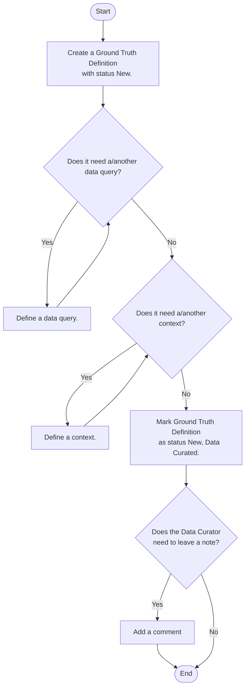
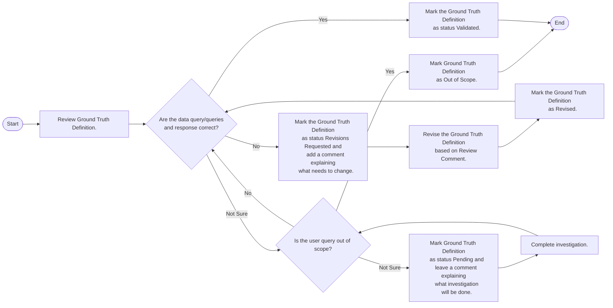

# Ground Truth Curation Flow Chart

- Author: Laura Lund
- Last Updated: 2025-09-15
- Tool: [Mermaid Chart](https://mermaid.js.org/)
- Docs: [Mermaid Syntax](https://docs.mermaidchart.com/mermaid-oss/syntax/flowchart.html#a-node-default)

## Overview

This flow chart describes the logic flow of the ground truth application.

### Ground Truth Definition

## Ground Truth Definition Validation Status Updates

