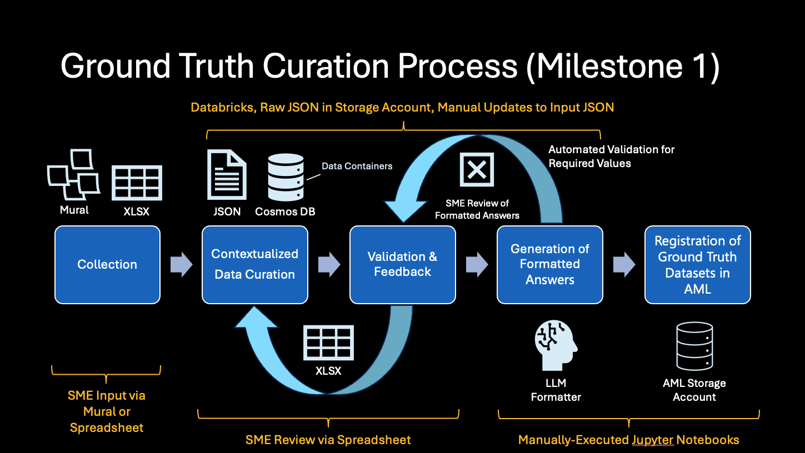
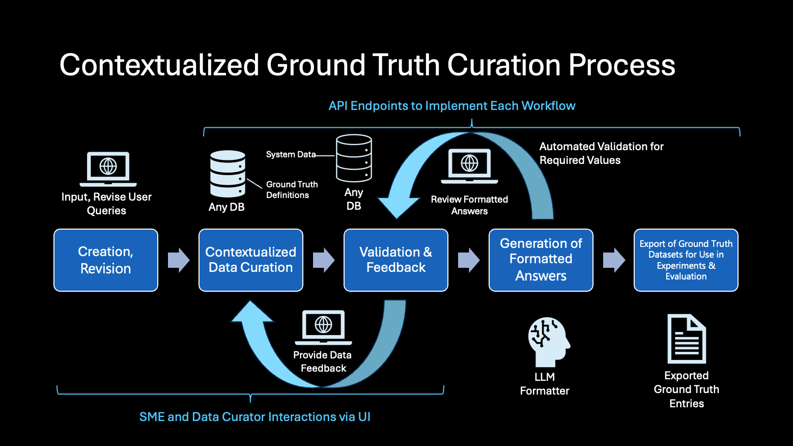

# Ground Truth Curation Process

Author: [Laura Lund](https://www.linkedin.com/in/lundlaura/)

[A version of this article was originally published on Medium](https://medium.com/@laura.l.lund/ground-truth-curation-process-for-ai-systems-590cbc93c1c0)

## Introduction

Imagine you’re building a powerful new AI assistant to support real business tasks such as answering maintenance questions in a manufacturing plant or surfacing insights from historical service data. To ensure that this AI system produces accurate and useful responses, we need a reliable way to measure its performance. That starts with defining what a “correct” answer actually looks like.

This is where the concept of **ground truth** comes in.

A collection of **ground truths** refers to a set of accurate, verified answers that serve as the benchmark against which an AI system’s outputs are evaluated. It’s the answer key for the tests you run to determine whether the system is behaving as expected. In practice, ground truths are carefully curated question-and-answer pairs that reflect what users should receive when they ask a particular question based on the system’s underlying data sources.

For example, if a user asks, “What are the most recent updates related to this item?”, the ground truth would be a verified, accurate list of those updates pulled directly from the system of record. This response represents the correct answer the AI system is expected to return and serves as the benchmark against which its performance can be tested and evaluated.

During a recent customer engagement, my team developed a structured approach to curate high-quality ground truths. This process was essential not just for evaluating the AI assistant’s performance, but also for building confidence among end users and stakeholders.

The key steps in our approach are:

1. Collection of real user questions: We want to build an AI system that can appropriately response to actual user queries.
2. Contextualized data curation: The association of relevant data grounded in a specific context for a given user question.
3. Subject matter expert (SME) validation: Collection of feedback from end users to ensure the curated data reflects domain expertise and business reality.
4. Generation of formatted answers: Using the curated raw data, we generate a response that is representative of what the real AI system might produce for a given question and context.
5. Export of ground truth datasets for use in experimentation and evaluation: Given the data input requirements for the experimentation framework, we export to the target file format.

Below you'll find detailed explanations for each step in our process to produce ground truths that truly reflect user intent and organizational knowledge.

## Step 1: Collecting User Questions

Once we’ve established access to the underlying data sources our AI system will rely on, the first step in building reliable ground truths is to gather a meaningful set of real user questions. While it’s possible to generate hypothetical prompts using the available data, these often miss the nuances, priorities, and terminology that actual users bring to the table. To develop ground truths that reflect real-world needs, we must engage directly with our target end users.

To do this, we conducted a focused, interactive workshop with subject matter experts (SMEs), who are the people who understand the business domain and will ultimately use or benefit from the AI system. These sessions are not only about collecting questions, but also about building shared understanding and trust.

We began the workshop by clearly explaining the purpose of the project: to develop an AI assistant that can answer user questions accurately and consistently by drawing on existing organizational data. We emphasized how their expertise and participation were crucial to shaping an assistant that would be genuinely helpful and aligned with their day-to-day challenges.

To help SMEs generate high-quality questions, we gave them a set of thought-starters in advance. These prompts were designed to spark ideas and encourage them to think in terms of real scenarios:

- What types of questions do you frequently ask in your daily work?
- What information is hard to find or requires digging through multiple systems?
- What would you ideally ask an AI assistant if it could understand your intent and return exactly what you need?
- Are there any follow-up questions you typically ask after receiving an initial answer?

During the session, we used a collaborative [Mural board](https://app.mural.co/t/microsoft1254/home), which is a virtual whiteboard with pre-labeled sections for different categories of questions. (If you have a Mural account, you can [view our template here](https://app.mural.co/template/c491d198-d624-48e2-9f09-3a8b8f984b93/f2d23239-ad03-4f22-842d-5fb7575e45f7).) Participants added their questions using digital sticky notes. This format encouraged conversation, cross-pollination of ideas, and deeper exploration of user needs. Importantly, _all questions were considered valid and valuable_, no matter how specific, broad, or exploratory.

The workshop yielded dozens of user-submitted questions, many of which built on each other as SMEs discussed and refined their inputs in real time. In the second half of the session, we worked together to organize and tag the questions. We applied a color-coding system to indicate which data sources or systems would be required to answer each one. This step helped us later in mapping questions to the right context and data during the ground truth curation phase.

This collaborative question collection process not only gave us a strong foundation of realistic prompts, but also fostered user buy-in. This helps ensure that the questions our AI assistant was being tested against were directly relevant to the people it was designed to serve.

## Step 2: Contextualized Data Curation

Once we had a rich set of real user questions, the next step was to connect those questions to the actual data that could be used to answer them. This is what we call contextualized data curation. This is the process of identifying and extracting the relevant records or facts that represent a “correct” response to each user question based on the available data.

This step is critical because it transforms abstract questions into concrete, testable pairs of input and expected output, which is the essence of a ground truth. It ensures that each ground truth is rooted not only in _what users want to know_, but also in _what the underlying data can support_.

To streamline the effort, we grouped similar or related user questions into small sets. This allowed our team to work in parallel, with different individuals or subgroups focused on curating data for different clusters of questions. We also partnered with data scientists from the customer’s organization, which helped accelerate progress and ensured alignment with internal data knowledge.

During our first milestone, we developed rudimentary custom tooling to support this phase. These tools enabled curators to define the data queries needed to answer each question and associate those queries with the relevant context using a well-defined, repeatable method.

For each user question, we followed a structured three-step process:

1. **Identify relevant data sources:** Determine which databases, data lakes, or structured files contain the information needed to answer the question.
2. **Define filters and properties:** For each relevant source, identify the fields and values that should be used to retrieve precise results. This might include timestamps, asset IDs, status fields, or other filters specific to the domain.
3. **Write and test the database query:** Construct a query that reliably returns the data needed for that specific question. These queries had to be complete and executable, returning interpretable results that could serve as the “correct” answer.

To give our queries real-world grounding and test their robustness, we introduced execution contexts. An execution context is a specific scenario or entity that the query should operate on. For example, a query might be applied to a particular customer account, project, or product instance, depending on the problem domain.

We intentionally selected a mix of contexts to reflect different types of outcomes:

- **Typical case:** A standard scenario where the query returns a reasonable, expected set of results.
- **Negative case:** A valid scenario where no data should be returned, which is useful for testing how the system handles empty or null responses.
- **Edge or extreme case:** A scenario that produces an unusually large or complex result such as a case with high data volume or inconsistent formatting, which helps stress-test the system.

By including this range of contexts, we ensured that the curated ground truths represented a realistic cross-section of how users might interact with the system from everyday questions to more difficult or uncommon scenarios.

This curated set of data-backed answers, anchored in well-defined contexts, became the foundation for the next step: automating the generation of structured ground truth files that could be validated and refined through SME review.

## Step 3: Subject Matter Expert Validation

Once we’ve curated contextualized data for each user question, the next critical step is validation. It is critical to ensure that the curated answers truly reflect what a domain expert would consider correct. After all, even a well-structured query can produce misleading or incomplete results if the intent of the question was misunderstood or if the wrong data properties were used.

To ensure the quality and credibility of our ground truths, we built a review loop centered on subject matter expert (SME) feedback. These experts are best positioned to assess whether the question was interpreted accurately and whether the returned data constitutes a valid and useful answer.

This collaborative loop with SMEs ensures that the final ground truth dataset is not only technically sound, but also aligned with domain expertise and user expectations. This is a foundational step in delivering trusted AI systems.

## Step 4: Generate Formatted Reponses

Because the raw data can sometimes be cumbersome to review, we use the raw data to generate a response similar to what the real AI system might produce. For example, if the real system produces a markdown table, we generate a markdown table in our ground truth entry. Using an LLM, we prompt it to format an answer to the given user query based on the raw data for a specific context. It is important to note that this LLM is completely separate from anything in the live AI system we are testing against.

As part of the formatted response process, we instruct the LLM to be sure to include all the values in the list of `responseRequiredValues`, which is a list of data points extracted during the contextualized data curation step. For each data query definition, we also define the property or properties that are deemed highly relevant to a correct answer. These properties might be an identifier, title, status, or other field that is more directly related to a good answer for a particular question. We introduced this concept of required values to facilitate evaluation of experiment results. The experimentation framework checks the AI system's response to determine whether or not included every required value defined in a ground truth.

## Step 5: Export Ground Truth Datasets

We curate ground truth entries to use in our experimentation evaluation process. The target format depends on the framework used at this step. During our engagement, we used Azure Machine Learning, which led us to export to `JSONL` format. Each line in the file defines a single ground truth entry with all the properties that are relevant within the evaluation step.

## Ground Truth Curation Tooling

During our first implementation of this process, we used a series of Databricks and Jupyter notebooks.

This version of ground truth curation involved manual steps to edit raw `JSON` files to save ground truth data query definitions, run these files through a notebook, and then use the `JSON` output in the next step of the process. One of the Databricks notebooks exported the conextualized ground truth entries to an `xlsx` file, which allowed SMEs to review data query definitions for each ground truth user query.

The manual workflow was slow and cumbersome for users. Given that we wanted to eventually scale our AI solution into other contexts, we needed a way to streamline the process and reduce the risk of user error.

This led us to build an application that implements each step of the process behind an API endpoint. A user interface makes it easier for SMEs to provide feedback and data curators to define and revise ground truth definitions. Moving to an application also allows us to improve security around data access. SMEs are given permission to provide reviews, mark a ground truth definition as needing revisions, or approve a ground truth definition as valid. Data curators are given permission to revise data query definitions and update the contexts associated with a given user query.

Instead of having multiple different file types (`JSON`, `XLSX`) and multiple different versions of a ground truth entry at different steps in the process, we defined a single ground truth document per user query that is updated at each step.

Data query definitions are generic. Any specific context values are stubbed with placeholder variables in the definition at the root of the ground truth document. When a context is added, its values are injected into the query at execution time, which retrieves the raw data associated with that context. Because data query defintions are generic, we can scale out across multiple different contexts with ease.

## Conclusion

High-quality ground truth data is the foundation of any reliable and trustworthy AI system. It ensures that models are not only trained on accurate examples but also evaluated against realistic, domain-relevant expectations.

By following a structured and collaborative process that collects authentic user questions, grounds those questions in real data, and validates the results with subject matter experts, teams can build ground truth datasets that reflect the complexity and nuance of real-world use cases.

This iterative approach doesn’t just improve model performance. It strengthens alignment between technical teams and end users, ensures transparency in how AI systems are evaluated, and ultimately fosters trust in the solutions being delivered.

Investing in the ground truth process is more than a technical necessity — it’s a strategic step toward building AI systems that are truly useful, dependable, and aligned with business goals.

## Acknowledgedments

I want to give special thanks to [Uffaz Nathaniel](https://www.linkedin.com/in/uffaz-nathaniel/) for collaborating on this article. I am grateful for the data science insights provided by [Amatullah Badshah](https://www.linkedin.com/in/amatullah-badshah/), [Farhan Baluch](https://www.linkedin.com/in/farhanbaluch/), and [Bryan Ostdiek](https://www.linkedin.com/in/bostdiek/) and the data expertise shared by [Jose Perales](https://www.linkedin.com/in/ejoseperales/). I also appreciate [Bindu Chinnasamy](https://www.linkedin.com/in/bindu-msft-cse/), [John Hauppa](https://www.linkedin.com/in/johnhauppa/), [Bryan Leighton](https://www.linkedin.com/in/bryan77/), [Cameron Taylor](https://www.linkedin.com/in/cameron-taylor-a27078127/), and [Kanishk Tantia](https://www.linkedin.com/in/kanishk-t-1723b2107/) for their valuable contributions to this project.
