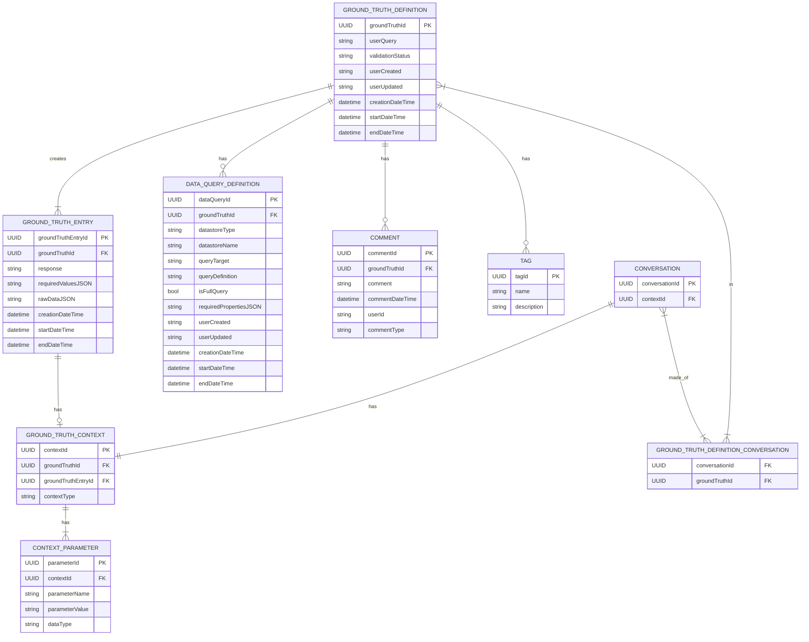

# Ground Truth Entity Relationship Diagram

- Author: Laura Lund
- Last Updated: 2025-09-15
- Tool: [Mermaid Chart](https://mermaid.js.org/)
- Docs: [Mermaid Syntax](https://mermaid.js.org/syntax/entityRelationshipDiagram.html)

## Overview

This diagram represents the ground truth data entities and their relationships. Ground truth objects
are modeled to be flexible across multiple different problem domains.

### Columns Common to Multiple Tables

- `creationDateTime`: The date and time this record was created
- `userId`: The Microsoft Entra userId
- `userCreated`: The Microsoft Entra userId of the user that created this record
- `userUpdated`: The Microsoft Entra serId of the user that most recently updated this record

### Columns for Tracking State

When present on a table, these columns represent the date range during
which a record was the current state. When an `endDateTime` is `NULL`,
that marks the record as the active record.

- `startDateTime`: The date and time this record became the current version
- `endDateTime`: The date and time this record became a historical version

### Ground Truth Definition

This is the base entity.

- `groundTruthId`: The primary key unique identifier for this ground truth definition
- `userQuery`: The natural language user query or question
- `validationStatus`: The validation status of this version of the ground truth definition

### Ground Truth Entry

This is the entity produced by the execution of a `Ground Truth Definition`'s
`Data Query Definition`(s) and at most one `Ground Truth Context`.

- `groundTruthEntryId`: The primary key unique identifier for this ground truth entry
- `groundTruthId`: The foreign key that points back to the ground truth definition that generated
  this ground truth entry
- `response`: The "correct answer,"
  which is generated by summarizing the raw data as a response to the `userQuery` defined in the
  `Ground Truth Definition`
- `requiredValuesJSON`: The stringified list of values that must be present in a
  valid answer (extracted from the `requiredPropertiesJSON` of a `Data Query Definition`)
- `rawDataJSON`: The stringified raw data that is retrieved by the executed data query definitions

### Data Query Definition

This is the entity that defines how to retrieve the data relevant to answering a given user query.
A `Ground Truth Definition` can have multiple data query definitions that target different
datastores or different query targets (e.g. containers, tables) within a datastore.

- `dataQueryId`: The primary key unique identifier for this data query
- `groundTruthId`: The foreign key that points back to the ground truth definition
- `datastoreType`: The type of datastore (e.g. SQL, Cosmos DB, GraphQL, etc.)
- `datastoreName`: The name that distinguishes this datastore from other datastores of the same type
- `queryTarget`: The target of the query such as a container or table name
- `queryDefinition`: The actual query string to be applied, which can be a full statement or
  just a filter, depending on the complexity required for a given user query
- `isFullQuery`: A booleon that specifies whether the `queryDefinition` is fully formed or
  if it needs to be combined with a base query prior to execution
- `requiredPropertiesJSON`: The stringified list of the most important raw data property names
  returned by the query that are deemed necessary for generating a relevant, complete answer

### Ground Truth Context

The execution context supports use cases in which a ground truth answer will vary depending on one
or more variables. Examples include product, customer, or manufacturing plant.

- `contextId`: The primary key unique identifier for this context
- `groundTruthEntryId`: The foreign key that points back to the ground truth entry
  for which this context relevant
- `contextType`: A general description of the purpose such as a product, customer, or manufacturing plant

### Context Parameter

This entity defines the fields within a `Ground Truth Context`. Simple contexts may have just one parameter while
others may have many.

- `parameterId`: The primary key unique identifier for this parameter
- `contextId`: The foreign key that points back to the context
- `parameterValue`: The value that should be substuted in a query after being converted from string
  to the target dataType
- `dataType`: The database data type--the system will attempt to parse from string to this type
  when building a parameterized query to execute against the database

### Comment

SME Reviewer and Data Curator personas may need to leave comments about a given `Ground Truth Definition`.

- `commentId`: The primary key unique identifier for this comment
- `groundTruthId`: The foreign key that points back to the ground truth
- `comment`: The actual text comment
- `commentDateTime`: The date and time the comment was added
- `commentType`: A comment is type `Review` if left by a Subject Matter Expert and is type `Curator Note`
  if left by a Data Curator

## Conversation

A `Conversation` is is grounded in a single `Ground Truth Context`.

- `conversationId`: The primary key unique identifier for a specific set of user queries
  that are asked across the same context
- `contextId`: The foreign key that points back to the context of this conversation

## Ground Truth Definition - Conversation Relationship Table

A relationship table that associates `conversationId` and `groundTruthId` identifiers to build
this many-to-many relationhip.
Multiple `Conversation` entites can related to multiple `Ground Truth Definition` entites.
