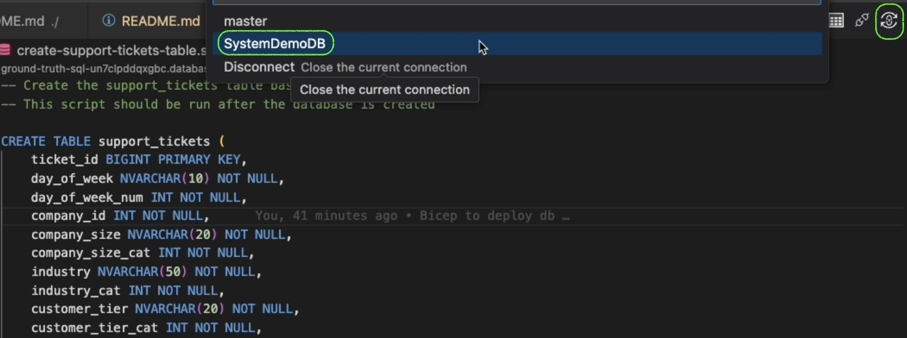

# Ground Truth Curation App - Azure Infrastructure

This directory contains the Azure infrastructure as code (IaC) for the Ground Truth Curation App using Bicep templates.

## Architecture

The infrastructure creates:
- **Resource Group**: `ground-truth-app-rg`
- **Azure SQL Server**: With a randomly generated name for uniqueness
- **Azure SQL Database**: `SystemDemoDB`
- **Support Tickets Table**: Schema optimized for the provided CSV data

## Files

- `main.bicep` - Main Bicep template defining all Azure resources
- `main.parameters.json` - Parameters file with default values
- `create-support-tickets-table.sql` - SQL script to create the support_tickets table
- `import-csv.py` - Python script for importing CSV data to the database
- `deploy.sh` - Automated deployment script (recommended)
- `data/Support_tickets.csv` - Sample data for seeding the database (48,900 records)

## Prerequisites

1. **Azure CLI** - Install from [https://docs.microsoft.com/en-us/cli/azure/install-azure-cli](https://docs.microsoft.com/en-us/cli/azure/install-azure-cli)
2. **Azure Subscription** - You'll need an active Azure subscription
3. **Permissions** - Contributor access to create resources
4. **Python 3.7+** - For running the CSV import script

   **Option A: Use the automated setup script (Recommended)**

   ```bash
   # Run the setup script (creates virtual environment and installs dependencies)
   ./setup.sh
   
   # After the script completes, activate the virtual environment
   cd .. && source .venv/bin/activate
   
   # Verify activation (you should see (.venv) in your prompt)
   which python
   ```

   **Option B: Manual setup**

   ```bash
   # Create virtual environment in project root
   cd .. && python3 -m venv .venv
   
   # Activate virtual environment
   source .venv/bin/activate
   
   # Install dependencies
   pip install -r infra/requirements.txt
   ```

## Quick Deployment

### Option 1: Using the Deploy Script (Recommended)

1. **Configure parameters** (optional):

   ```bash
   # Edit main.parameters.json to customize settings
   nano main.parameters.json
   ```

2. **Run the deployment script**:

   ```bash
   cd infra
   ./deploy.sh
   ```

### Option 2: Manual Deployment

1. **Login to Azure**:

   ```bash
   az login
   ```

2. **Create Resource Group**:

   ```bash
   az group create --name ground-truth-app-rg --location westus2
   ```

3. **Deploy Infrastructure**:

   ```bash
   az deployment group create \
     --resource-group ground-truth-app-rg \
     --template-file main.bicep \
     --parameters @main.parameters.json
   ```

## Post-Deployment Steps

1. **Create the support_tickets table**:
   - Connect to your SQL Database using SQL Server Management Studio, Azure Data Studio, or the Azure portal
   - Run the SQL script: `create-support-tickets-table.sql` **NOTE:** Make sure you are connected to the `SystemDemoDB` database prior to execution.

   

2. **Import CSV data**:
    For Python CSV import tools (optional, only needed for database setup):

    ```sh
    # Run the setup script to create Python virtual environment
    ./setup.sh

    # Or manually:
    python3 -m venv .venv
    source .venv/bin/activate
    pip install -r infra/requirements.txt
    ```

    Import data:
   - Use the provided Python script: `python import-csv.py`
   - The script handles chunked imports to avoid connection timeouts
   - Successfully imports all 48,900 records from the CSV file

## Configuration

### Database Settings

The default configuration creates a Basic tier SQL Database suitable for development and hackathons. The configuration includes:

- **Public Network Access**: Enabled for hackathon/development use
- **Mixed Authentication**: Both SQL Server auth and Azure AD supported
- **Open Firewall Rules**: Allows connections from any IP (development only)

### Security Settings

⚠️ **Important Security Notes**:

1. **Firewall rules allow all IPs** - This is configured for hackathon/development use
2. **Change the default admin password** in `main.parameters.json`
3. **Restrict firewall rules** for production deployments
4. **Mixed authentication** is enabled - disable Azure AD-only restriction for SQL auth

### Connection Information

After deployment, you'll get:
- SQL Server FQDN (format: `ground-truth-sql-{uniquestring}.database.windows.net`)
- Database name: `SystemDemoDB`
- Connection string for applications
- Admin credentials (as configured in parameters)

## Support Tickets Table Schema

The table includes 33 columns optimized for the CSV data with proper data types:

| Column | Type | Description |
|--------|------|-------------|
| ticket_id | BIGINT | Primary key |
| day_of_week | NVARCHAR(10) | Day name |
| company_id | INT | Company identifier |
| priority | NVARCHAR(20) | Ticket priority |
| customer_sentiment | NVARCHAR(20) | Customer satisfaction (nullable) |
| error_rate_pct | DECIMAL(15,9) | Error rate percentage with high precision |
| product_area | NVARCHAR(50) | Product area affected |
| customer_tier | NVARCHAR(20) | Customer tier classification |
| region | NVARCHAR(50) | Geographic region |
| ... | ... | [See full schema in create-support-tickets-table.sql] |

### Key Features

- **DECIMAL(15,9)** for error_rate_pct to handle precise percentage values
- **Nullable customer_sentiment** to accommodate missing data
- **Optimized indexes** for common query patterns
- **Primary key** on ticket_id for data integrity

### Indexes

Optimized indexes are created for common query patterns:
- company_id
- priority  
- customer_tier
- product_area
- region
- day_of_week

## CSV Import Script

The `import-csv.py` script provides reliable data import with these features:

- **Chunked processing**: Imports data in 5,000-record batches to avoid timeouts
- **Error handling**: Robust connection management and retry logic
- **Progress tracking**: Shows import progress and statistics
- **Data validation**: Handles NULL values and data type conversions

### Usage

```bash
python import-csv.py
```

The script will prompt for:
- SQL Server name (e.g., ground-truth-sql-xyz.database.windows.net)
- Database name (SystemDemoDB)
- Username and password
- CSV file path

### Import Results

Successfully imports all 48,900 records from the Support_tickets.csv file.

## Troubleshooting

### Common Issues

1. **"Location not available"** - Change location in parameters file to `westus2`
2. **"Server name already exists"** - The script uses uniqueString() to avoid conflicts
3. **"Firewall blocking connection"** - Firewall rules are configured for open access in hackathon setup
4. **"Authentication failed"** - Use SQL Server authentication (not Azure AD) for import scripts

### Cleanup

To remove all resources:

```bash
az group delete --name ground-truth-app-rg --yes --no-wait
```

## Cost Estimation

Basic configuration costs approximately:
- SQL Database (Basic): ~$5/month
- SQL Server: No additional cost
- Storage: Included in Basic tier

For production workloads, consider Standard or Premium tiers.

## Data Source

The infrastructure is designed to work with the support ticket dataset from [Kaggle.com](https://www.kaggle.com/datasets/albertobircoci/support-ticket-priority-dataset-50k?resource=download).

Dataset contains 48,900 records with detailed support ticket information including priorities, customer data, error rates, and regional information.

You will need to unzip [this dataset](./data/Support_tickets.zip) to open the `.csv`.