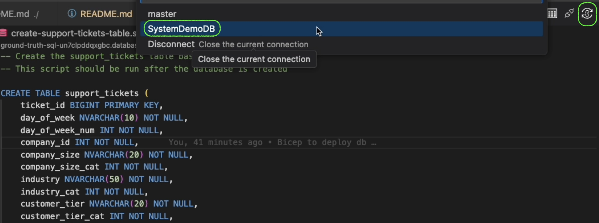

# Ground Truth Curation App - Azure Infrastructure

This directory contains the Azure infrastructure as code (IaC) for the Ground Truth Curation App using Bicep templates.

## Architecture

The infrastructure creates:
- **Resource Group**: `ground-truth-app-rg`
- **System SQL Server**: `gt-system-data-sql` for system/demo data
- **System SQL Database**: `ManufacturingDataRelDB` for system demo data
- **Ground Truth SQL Server**: `ground-truth-curation-sql` for curation workflow
- **Ground Truth SQL Database**: `GroundTruthCurationDB` for curation workflow data
- **Azure Cosmos DB**: `gt-system-data-cosmos` serverless NoSQL database for system/demo data
- **Virtual Network**: Dedicated VNet and subnet hosting private endpoints for database resources

## Files

- `main.bicep` - Main Bicep template defining all Azure resources
- `main.parameters.json` - Parameters file with required values only
- `create-support-tickets-table.sql` - SQL script to create the support_tickets table
- `create-ground-truth-tables.sql` - SQL script to create ground truth curation tables
- `create-ground-truth-tag-relationships.sql` - SQL script for tag relationships and default tags
- `insert-sample-ground-truth-data.sql` - SQL script with sample ground truth data
- `drop-ground-truth-tables.sql` - SQL script to clean up ground truth tables (development only)
- `DATABASE_SCRIPTS_README.md` - Documentation for all database scripts
- `import-support-tickets-csv.py` - Python script for importing CSV data to the database
- `upload-defects-csv.py` - Python script for uploading defects data to Cosmos DB
- `deploy.sh` - Automated deployment script with automatic existence checking
- `data/Support_tickets.csv` - Sample data for seeding the SQL database (48,900 records)
- `data/defects_data_with_company.csv` - Manufacturing defects data for Cosmos DB

## Deployment Prerequisites

1. **Azure CLI** - Install from [https://docs.microsoft.com/en-us/cli/azure/install-azure-cli](https://docs.microsoft.com/en-us/cli/azure/install-azure-cli)
2. **Azure Subscription** - You'll need an active Azure subscription
3. **Permissions** - Contributor access to create resources
4. **Python 3.7+** - For running the CSV import script
5. **SQL Server Command Line Tools (sqlcmd)** - Required for automatic App Service database access configuration

   **Installing sqlcmd:**

   **macOS:**

   ```bash
   brew tap microsoft/mssql-release https://github.com/Microsoft/homebrew-mssql-release
   brew update
   brew install mssql-tools

   # Add to PATH (add to ~/.zshrc or ~/.bash_profile to make permanent)
   echo 'export PATH="/usr/local/opt/mssql-tools/bin:$PATH"' >> ~/.zshrc
   source ~/.zshrc
   ```

   **Linux (Ubuntu/Debian):**

   ```bash
   curl https://packages.microsoft.com/keys/microsoft.asc | sudo apt-key add -

   # Ubuntu 20.04
   sudo add-apt-repository "$(wget -qO- https://packages.microsoft.com/config/ubuntu/20.04/prod.list)"

   # Ubuntu 22.04
   sudo add-apt-repository "$(wget -qO- https://packages.microsoft.com/config/ubuntu/22.04/prod.list)"

   sudo apt-get update
   sudo apt-get install mssql-tools unixodbc-dev

   # Add to PATH
   echo 'export PATH="$PATH:/opt/mssql-tools/bin"' >> ~/.bashrc
   source ~/.bashrc
   ```

   **Verify installation:**

   ```bash
   sqlcmd '-?'
   ```

   **Note:** If sqlcmd is not installed, the deployment script will skip automatic SQL database access configuration for App Services. You can manually configure access using the SQL script at `infra/deploy/scripts/configure-backend-sql-access.sql`.

   **Option A: Use the automated setup script (Recommended)**

   ```bash
   # Run the setup script in `infra/seed (creates virtual environment and installs dependencies)
   ./setup.sh

   # After the script completes, activate the virtual environment
   cd .. && source .venv/bin/activate

   # Verify activation (you should see (.venv) in your prompt)
   which python
   ```

   **Option B: Manual setup**

   ```bash
   # Create virtual environment in project root
   cd .. && python3 -m venv .venv

   # Activate virtual environment
   source .venv/bin/activate

   # Install dependencies
   pip install -r infra/requirements.txt
   ```

## Quick Deployment

### Prerequisites

1. **Azure CLI** - Install from [https://docs.microsoft.com/en-us/cli/azure/install-azure-cli](https://docs.microsoft.com/en-us/cli/azure/install-azure-cli)
2. **Azure Subscription** - You'll need an active Azure subscription
3. **Permissions** - Contributor access to create resources
4. **Environment File** - Create `.env` file with required password

### Setup Environment

1. **Create .env file**:

   ```bash
   cd infra
   cp .env.example .env
   # Edit .env and set SQL_ADMIN_PASSWORD=YourSecurePassword123!
   # Optional: set ADMIN_CLIENT_IP=203.0.113.10 to force a SQL firewall rule
   # Optional: set SKIP_ADMIN_IP_DISCOVERY=1 to skip automatic IP detection
   ```

2. **Login to Azure**:

   ```bash
   az login
   ```

### Automatic Resource Management

The deployment uses **automatic existence checking** - no manual configuration needed:
- ✅ **Deterministic naming**: All resources have predictable names
- ✅ **Incremental deployment**: Azure automatically skips existing resources
- ✅ **Idempotent**: Safe to run multiple times
- ✅ **No boolean flags**: No risk of human error with conditional parameters

### Option 1: Using the Deploy Script (Recommended)

1. **Configure parameters** (optional):

   ```bash
   # Edit main.parameters.json to customize settings
   nano main.parameters.json
   ```

2. **Run the deployment script**:

   ```bash
   cd infra
   ./deploy.sh
   ```

### Option 2: Manual Deployment

1. **Login to Azure**:

   ```bash
   az login
   ```

2. **Create Resource Group**:

   ```bash
   az group create --name ground-truth-app-rg --location westus2
   ```

3. **Deploy Infrastructure**:

   ```bash
   az deployment group create \
     --resource-group ground-truth-app-rg \
     --template-file main.bicep \
     --parameters @main.parameters.json
   ```

## Post-Deployment Steps

### 1. Setup System Data (Required)

1. **Create the support_tickets table**:
   - Connect to your **System SQL Database** (`ManufacturingDataRelDB`) using SQL Server Management Studio, Azure Data Studio, or the Azure portal
   - Server: `gt-system-data-sql.database.windows.net`
   - Run the SQL script: `create-support-tickets-table.sql`

   

2. **Import CSV data**:
    For Python CSV import tools (optional, only needed for database setup):

    ```sh
    # Run the setup script to create Python virtual environment
    ./setup.sh

    # Or manually:
    python3 -m venv .venv
    source .venv/bin/activate
    pip install -r infra/requirements.txt
    ```

    Import data:
   - Use the provided Python script: `python import-support-tickets-csv.py`
   - The script handles chunked imports to avoid connection timeouts
   - Successfully imports all 48,900 records from the CSV file

### 2. Setup Ground Truth Curation Database (Required)

1. **Create ground truth tables**:
   - Connect to your **Ground Truth SQL Database** (`GroundTruthDB`) using SQL Server Management Studio, Azure Data Studio, or the Azure portal
   - Server: `ground-truth-curation-sql.database.windows.net`
   - Run the SQL scripts in this order:
     1. `create-ground-truth-tables.sql` - Creates all main tables and relationships
     2. `create-ground-truth-tag-relationships.sql` - Creates tag relationships and default tags

2. **Load sample data** (Optional for development/testing):
   - Run the SQL script: `insert-sample-ground-truth-data.sql`
   - This provides realistic test data for all ground truth tables
   - **Skip this step in production environments**

3. **Verify setup**:
   - Check that all 10 ground truth tables were created successfully
   - Confirm default tags are present
   - Review sample data (if loaded) to understand the data model

   See `DATABASE_SCRIPTS_README.md` for detailed documentation of all tables and relationships.

## Configuration

### Database Settings

The default configuration creates a Basic tier SQL Database suitable for development and hackathons. The configuration includes:

- **Public Network Access**: Enabled for hackathon/development use
- **Mixed Authentication**: Both SQL Server auth and Azure AD supported
- **Open Firewall Rules**: Allows connections from any IP (development only)

### Security Settings

⚠️ **Important Security Notes**:

1. **Private networking** - A virtual network and data-services subnet host private endpoints for SQL Servers and Cosmos DB.
2. **Targeted firewall rule** - `deploy.sh` auto-detects your public IP and opens a single-address SQL firewall rule.
   Set `ADMIN_CLIENT_IP` in `.env` to override, or `SKIP_ADMIN_IP_DISCOVERY=1` to disable detection.
3. **Credential hygiene** - Change the default admin password in `main.parameters.json` and store it securely.
4. **Public access review** - Cosmos DB keeps public network access enabled for tooling; disable it if your environment requires private-only connectivity.
5. **Authentication mix** - SQL auth remains enabled for tooling (Azure AD-only mode is disabled); adjust to meet compliance requirements.

If automatic IP discovery fails, add a firewall rule manually:

```bash
az sql server firewall-rule create \
   --resource-group <resource-group> \
   --server <sql-server-name> \
   --name AdminWorkstation \
   --start-ip-address <your-ip> \
   --end-ip-address <your-ip>
```

You can also add the rule through the Azure portal under **Security > Networking** for each SQL Server.

### Networking Overview

- **Virtual network**: `<prefix>-vnet` by default; customize CIDR ranges via `vnetAddressPrefixes` and `dataSubnetPrefix` parameters.
- **Data-services subnet**: Hosts private endpoints and disables private endpoint network policies as required by Azure.
- **Private DNS zones**: `privatelink.database.windows.net` and `privatelink.documents.azure.com` are linked to the VNet for seamless name resolution.
- **SQL firewall management**: Automatic IP detection feeds the `adminClientIpAddress` parameter. Provide `ADMIN_CLIENT_IP` or skip detection to control access manually.
- **Connectivity expectation**: Without an IP rule, SQL endpoints are reachable only from within the virtual network (VPN, peered VNet, or Azure service).

### Connection Information

After deployment, you'll get:
- **System SQL Server**: `gt-system-data-sql.database.windows.net`
- **System Database**: `ManufacturingDataRelDB` (for support tickets and system data)
- **Ground Truth SQL Server**: `ground-truth-curation-sql.database.windows.net`
- **Ground Truth Database**: `GroundTruthCurationDB` (for curation workflow data)
- **Cosmos DB Account**: `gt-system-data-cosmos` (for manufacturing defects)
- **Virtual Network**: `<prefix>-vnet` (data-services subnet resource ID captured in `.env`)
- **Private Endpoints**: Resource IDs for SQL and Cosmos endpoints appended to `.env`
- Connection strings for both SQL databases
- Admin credentials (as configured in parameters)

## Support Tickets Table Schema

The table includes 33 columns optimized for the CSV data with proper data types:

| Column             | Type          | Description                                           |
| ------------------ | ------------- | ----------------------------------------------------- |
| ticket_id          | BIGINT        | Primary key                                           |
| day_of_week        | NVARCHAR(10)  | Day name                                              |
| company_id         | INT           | Company identifier                                    |
| priority           | NVARCHAR(20)  | Ticket priority                                       |
| customer_sentiment | NVARCHAR(20)  | Customer satisfaction (nullable)                      |
| error_rate_pct     | DECIMAL(15,9) | Error rate percentage with high precision             |
| product_area       | NVARCHAR(50)  | Product area affected                                 |
| customer_tier      | NVARCHAR(20)  | Customer tier classification                          |
| region             | NVARCHAR(50)  | Geographic region                                     |
| ...                | ...           | [See full schema in create-support-tickets-table.sql] |

### Key Features

- **DECIMAL(15,9)** for error_rate_pct to handle precise percentage values
- **Nullable customer_sentiment** to accommodate missing data
- **Optimized indexes** for common query patterns
- **Primary key** on ticket_id for data integrity

### Indexes

Optimized indexes are created for common query patterns:
- company_id
- priority
- customer_tier
- product_area
- region
- day_of_week

## CSV Import Script

The `import-support-tickets-csv.py` script provides reliable data import with these features:

- **Chunked processing**: Imports data in 5,000-record batches to avoid timeouts
- **Error handling**: Robust connection management and retry logic
- **Progress tracking**: Shows import progress and statistics
- **Data validation**: Handles NULL values and data type conversions

### Usage

```bash
python import-support-tickets-csv.py
```

The script will prompt for:
- SQL Server name (e.g., ground-truth-sql-xyz.database.windows.net)
- Database name (SystemDemoDB)
- Username and password
- CSV file path

### Import Results

Successfully imports all 48,900 records from the Support_tickets.csv file.

## Working with Restrictive Subscription Policies

If your Azure subscription has policies that **automatically disable public network access** on SQL Servers and Cosmos DB (typically seen in enterprise subscriptions), you won't be able to connect to your databases from your local development machine using standard connection strings.

### The Problem

When Azure Policy enforces `publicNetworkAccess: 'Disabled'`:
- SQL Server firewall rules cannot be created or modified
- Direct connections from your local machine fail with error **47073** (DenyPublicEndpointEnabled)
- The policy automatically remediates any manual changes within 15-60 minutes
- Only connections from within the Azure VNet are allowed

### The Solution: Update Network Settings in Azure Portal

1. Navigate to the Ground Truth Curation SQL Server resource in Azure Portal.
2. Under `Networking > Public Access` select `Selected networks`.
3. Add your client IPv3 Address.

**Note:** Cosmos DB connections still use the public endpoint with access keys - no tunnel needed.

### Daily Development Workflow

1. **Update Network Policty**: Confirm that your IP address is listed in the allowed networks list or add it if needed
2. **Start backend**: `dotnet run` in a separate terminal
3. **Develop normally**: All database connections work transparently
4. **Stop development**: Press Ctrl+C in tunnel terminal to close connections

### Cost Management

To minimize costs when not actively developing:

```bash
# Deallocate VM when done for the day (stops billing for compute)
az vm deallocate --resource-group gt-mar-2-ground-truth-app-rg --name dev-jumpbox

# Restart VM when you need it
az vm start --resource-group gt-mar-2-ground-truth-app-rg --name dev-jumpbox
```

**Billing when deallocated:** Only storage (~$2/month for OS disk) - compute charges stop.

### Cleanup Jumpbox

To completely remove the jumpbox when you no longer need it:

```bash
az vm delete --resource-group gt-mar-2-ground-truth-app-rg --name dev-jumpbox --yes
az disk list --resource-group gt-mar-2-ground-truth-app-rg --query "[?contains(name, 'dev-jumpbox')]" -o table
# Delete any remaining disks if needed
```

### Troubleshooting SSH Tunnel Connection

If the tunnel script fails or SSH times out:

1. **Verify jumpbox is running:**

   ```bash
   az vm show -g gt-mar-2-ground-truth-app-rg -n dev-jumpbox -d --query "{Name:name, PowerState:powerState, PublicIP:publicIps}"
   ```

2. **Check NSG rule was created:**

   ```bash
   az network nsg rule show --resource-group gt-mar-2-ground-truth-app-rg \
     --nsg-name gt-mar-2-vnet-data-services-nsg-centralus \
     --name AllowSSHFromAdmin
   ```

   If missing or your IP changed, re-run `./quickstart-jumpbox.sh` to update it.

3. **Test SSH connectivity directly:**

   ```bash
   VM_IP=$(az vm show -g gt-mar-2-ground-truth-app-rg -n dev-jumpbox -d --query publicIps -o tsv)
   ssh -o ConnectTimeout=5 azureuser@$VM_IP "echo 'SSH works!'"
   ```

4. **Manual NSG fix (if needed):**

   ```bash
   MY_IP=$(curl -s https://api.ipify.org)
   az network nsg rule create \
     --resource-group gt-mar-2-ground-truth-app-rg \
     --nsg-name gt-mar-2-vnet-data-services-nsg-centralus \
     --name AllowSSHFromAdmin \
     --priority 100 \
     --direction Inbound \
     --access Allow \
     --protocol Tcp \
     --source-address-prefixes $MY_IP \
     --destination-port-ranges 22
   ```

## Troubleshooting

### Common Issues

1. **"Location not available"** - Change location in parameters file to `westus2`
2. **"Server name already exists"** - The script uses uniqueString() to avoid conflicts
3. **"Firewall blocking connection"** or **Error 47073 (DenyPublicEndpointEnabled)**:
   - If your subscription has Azure Policies that disable public network access, you cannot use firewall rules
   - See [Working with Restrictive Subscription Policies](#working-with-restrictive-subscription-policies) for the SSH tunnel workaround
   - If public access is allowed: Confirm that your IP was detected or provide `ADMIN_CLIENT_IP`
4. **"Authentication failed"** - Use SQL Server authentication (not Azure AD) for import scripts
5. **SQL Error 40615 - "Client with IP address 'X.X.X.X' is not allowed"**:
   - Your outbound IP to Azure isn't in the SQL firewall rules
   - **Find your outbound IP:** Try connecting - the error message shows the exact IP Azure sees
   - **Alternative detection:** `curl -s ipinfo.io/ip` (may differ from Azure's perspective if behind corporate NAT)
   - **Add to firewall:** Azure Portal → SQL Server → Security → Networking → Add firewall rule with the IP from the error message
   - **Important:** Your public IP detected by tools like `ipinfo.io` may differ from your outbound IP to Azure if you're behind corporate NAT/proxy. Always use the IP shown in SQL Server error messages.
   - Apply the same rule to both SQL servers: `gt-mar-2-ground-truth-curation-sql` and `gt-mar-2-gt-system-data-sql`
   - Wait 2-3 minutes for firewall rules to propagate

### Cleanup

To remove all resources:

```bash
az group delete --name ground-truth-app-rg --yes --no-wait
```

## Cost Estimation

Basic configuration costs approximately:
- SQL Database (Basic): ~$5/month
- SQL Server: No additional cost
- Storage: Included in Basic tier
- **Cosmos DB (Serverless)**: Pay-per-request pricing
  - No minimum charges or upfront costs
  - ~$0.25 per million Request Units (RUs) consumed
  - ~$0.25/GB per month for storage
  - Ideal for development, testing, and variable workloads

For production workloads, consider Standard or Premium tiers for SQL Database and evaluate provisioned throughput for Cosmos DB if you have predictable traffic patterns.

## Azure Cosmos DB Configuration

The infrastructure includes a serverless Azure Cosmos DB account with:

### Database and Containers
- **Database**: `ManufacturingDataDocDB`
- **Containers**:
  - `repairs`: Manufacturing defects and cost data (partitioned by `/partitionKey`)

### Cosmos DB Features
- **Serverless billing**: Only pay for consumed Request Units and storage
- **Automatic indexing**: All properties are indexed by default for flexible queries
- **Global accessibility**: NoSQL API compatible with MongoDB, SQL queries, and REST APIs
- **Hackathon-friendly**: Open public access for easy development
- **Deterministic naming**: `gt-system-data-cosmos` for predictable resource management

### Cosmos DB Connection Information
After deployment, you'll get:
- Cosmos DB Account Name: `gt-system-data-cosmos`
- Endpoint: `https://gt-system-data-cosmos.documents.azure.com:443/`
- Primary keys available through Azure portal or CLI

### Data Upload
Use the provided script to upload manufacturing defects data:

```bash
python upload-defects-csv.py
```

### Sample Commands

```bash
# Get Cosmos DB connection details
az cosmosdb show --name <cosmos-account-name> --resource-group ground-truth-app-rg
az cosmosdb keys list --name <cosmos-account-name> --resource-group ground-truth-app-rg
```

## Data Source

The infrastructure is designed to work with the following data sets [Kaggle.com](https://www.kaggle.com):

- [Support Tickets](https://www.kaggle.com/datasets/albertobircoci/support-ticket-priority-dataset-50k?resource=download)
- [Manufacturing Defects](https://www.kaggle.com/datasets/fahmidachowdhury/manufacturing-defects/data)

The Support Tickets dataset contains 48,900 records with detailed support ticket information including priorities, customer data, error rates, and regional information.

The Manufacturing Defects dataset has 1,000 records across 100 different product ids.

**NOTE:** For the purposes of Ground Truth Curation App development, I have modified the Manufacturing Defects data set to add a `company_id` that exists in the Support Tickets data set.

You will need to unzip [this dataset](./data/Support_tickets.zip) to open the support tickets `.csv`. Unzip [this dataset](./data/defects_data_with_company.csv.zip) to open the defects and cost data.
